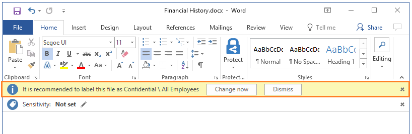

# Como configurar as condições para classificação automática e recomendada para o Azure Information Protection

>*Aplica-se a: [Azure Information Protection](https://azure.microsoft.com/pricing/details/information-protection)*

Quando configurar as condições para uma etiqueta, pode atribuir automaticamente uma etiqueta a um documento ou a um e-mail. Em alternativa, pode pedir aos utilizadores que selecionem a etiqueta recomendada. 

Quando configurar estas condições, pode utilizar padrões predefinidos, tais como **número de cartão de crédito** ou **número de Segurança Social dos E.U.A. (SSN)**. Em alternativa, pode definir uma cadeia personalizada ou um padrão como condição para classificação automática. Estas condições aplicam-se ao corpo de texto em documentos e e-mails, bem como a cabeçalhos e rodapés. Para obter mais informações sobre as condições, consulte o passo 5 do [seguir o procedimento](#to-configure-recommended-or-automatic-classification-for-a-label).

Para a melhor experiência de utilizador e para assegurar a continuidade do negócio, recomendamos que comece pela classificação recomendada ao utilizador em vez da classificação automática. Esta configuração permite aos utilizadores aceitar a classificação e qualquer proteção associado ou substituir estas sugestões se não forem adequados para o seu documento ou mensagem de e-mail.

Um exemplo de aviso para quando configura uma condição para aplicar uma etiqueta como uma ação recomendada, com uma sugestão de política personalizada:

Neste exemplo, o utilizador pode clicar em **alterar agora** para aplicar a etiqueta recomendada ou substituir a recomendação selecionando **dispensar**. Se o utilizador escolhe a ignorar a recomendação e a condição ainda se aplica quando o documento é aberto em seguida, é apresentada a recomendação de etiqueta. 

> [!IMPORTANT]
>Não configure uma etiqueta para a classificação automática e uma permissão definido pelo utilizador. A opção de permissões definidas pelo utilizador é um [definição de proteção](configure-policy-protection.md) que permita aos utilizadores que especifique que devem ser concedidas permissões.
>
>Quando uma etiqueta está configurada para classificação automática e permissões definidas pelo utilizador, o conteúdo é verificado para as condições e a definição de permissão definido pelo utilizador não é aplicada. Pode utilizar a classificação recomendada e permissões definidas pelo utilizador.

## Como são aplicadas as etiquetas automáticas ou recomendadas

- A classificação automática aplica-se ao Word, Excel e PowerPoint quando os documentos são guardados e aplicam-se ao Outlook quando os e-mails são enviados. 
    
    Não é possível utilizar a classificação automática para documentos e e-mails que foram anteriormente etiquetados de forma manual ou anteriormente automaticamente com a etiqueta com uma classificação superior. 

- A classificação recomendada aplica-se ao Word, Excel e PowerPoint quando os documentos são guardados. Não é possível utilizar a classificação recomendada para o Outlook.
    
    Não é possível utilizar a classificação recomendada para os documentos que foram anteriormente etiquetados com uma classificação superior. 

Pode alterar este comportamento para que o cliente Azure Information Protection verifica periodicamente a documentos para as regras de condição que especificar. Esta configuração requer um [definição de cliente avançado](../rms-client/client-admin-guide-customizations.md#turn-on-classification-to-run-continuously-in-the-background) que está atualmente em pré-visualização.

### São avaliadas como várias condições quando estas são aplicadas a mais do que uma etiqueta

1. As etiquetas são ordenadas para avaliação de acordo com a respetiva posição que especificou na política: a etiqueta posicionada em primeiro tem a posição mais baixa (menos confidencial) e a etiqueta posicionada em último tem a posição mais elevada (mais confidencial).

2. A etiqueta mais confidencial é aplicada.
 
3. A última sublabel é aplicada.

## Para configurar a classificação recomendada ou automática para uma etiqueta

1. Se ainda não o tiver feito, abra uma nova janela do browser e [inicie sessão no portal do Azure](configure-policy.md#signing-in-to-the-azure-portal). Em seguida, navegue para o painel **Azure Information Protection**. 
    
    Por exemplo, no hub menu, clique em **todos os serviços** e comece a escrever **informações** na caixa Filtro. Selecione **Azure Information Protection**.

2. Do **classificações** > **etiquetas** opção do menu: no **Azure Information Protection - etiquetas** painel, selecione a etiqueta a configurar.

3. No painel **Etiqueta**, na secção **Configurar condições para aplicar esta etiqueta automaticamente**, clique em **Adicionar uma nova condição**.

4. No **condição** painel, selecione **tipos de informações** se pretender utilizar uma condição predefinida, ou **personalizada** se pretender especificar os seus próprios:
    - Para **tipos de informações**: selecione na lista de condições disponíveis e, em seguida, selecione o número mínimo de ocorrências e se a ocorrência deve ter um valor único a ser incluído na contagem de ocorrências.
        
        Os tipos de informações utilizam os tipos de informações de sensibilidade perda prevenção (DLP) do Office 365 dados e a deteção de padrão. Pode escolher entre vários tipos comuns de informações confidenciais, algumas das quais são específicas para diferentes regiões. Para obter mais informações, consulte [que os tipos de informações confidenciais serve para](https://support.office.com/article/What-the-sensitive-information-types-look-for-fd505979-76be-4d9f-b459-abef3fc9e86b) na documentação do Office.
        
        A lista de tipos de informações que pode selecionar a partir do portal do Azure é atualizada periodicamente para incluir quaisquer novas adições de DLP do Office. No entanto, a lista exclui quaisquer tipos de informações confidenciais personalizadas que tenha definido e carregado como um pacote de regra para o Office 365 segurança & Centro de conformidade. 
        
        Quando o Azure Information Protection avalia os tipos de informações que selecionar, não utiliza a definição de nível de confiança de DLP do Office mas coincide de acordo com a confiança mais baixa.
    
    - Para **Personalizada**: especifique um nome e uma expressão correspondente, que tem de excluir aspas e carateres especiais. Em seguida, especifique se correspondente como uma expressão regular, sensibilidade às maiúsculas e de utilização e o número mínimo de ocorrências e se a ocorrência deve ter um valor único a ser incluído na ocorrência da contagem.
        
        As expressões regulares, utilize os padrões de regex do Office 365. Para obter mais informações, consulte [que define a expressão regular com a base de correspondências](https://technet.microsoft.com/library/jj674702(v=exchg.150).aspx#Anchor_2) na documentação do Office. Além disso, poderá achar útil para referência [sintaxe de expressão Regular Perl](http://www.boost.org/doc/libs/1_66_0/libs/regex/doc/html/boost_regex/syntax/perl_syntax.html) de aumento.
        
5. Decida se precisa de alterar o **número mínimo de ocorrências** e **ocorrência de contagem com valor exclusivo apenas**e, em seguida, selecione **guardar**. 
    
    Exemplo das opções de ocorrências: selecione o tipo de informações para o número de segurança social, conjunto o número mínimo de ocorrências como 2 e um documento tiver o mesmo número de segurança social listado duas vezes: Se definir o **contagem de ocorrências com valor exclusivo apenas** para **no**, a condição não for cumprida. Se definir esta opção para **desativar**, a condição for satisfeita.

6. Reverter o **etiqueta** painel, configure o seguinte e, em seguida, clique em **guardar**:
    
    - Escolha a classificação automática ou recomendada: para **Selecionar a forma como esta etiqueta é aplicada: automaticamente ou recomendada para o utilizador**, selecione **Automática** ou **Recomendada**.
    
    - Especifique o texto do aviso ao utilizador ou da sugestão de política: mantenha o texto predefinido ou especifique uma cadeia própria.

Ao clicar em **guardar**, as alterações são automaticamente disponibilizadas a utilizadores e serviços. Já não é uma opção de publicar separado.

## Próximos passos

Considere implementar o [scanner do Azure Information Protection](deploy-aip-scanner.md), que pode utilizar as regras de classificação automática para detetar, classificar e proteger os ficheiros nos arquivos de ficheiros de locais e partilhas de rede.  

Para mais informações sobre como configurar a política do Azure Information Protection, utilize as ligações na secção [Configurar política da organização](configure-policy.md#configuring-your-organizations-policy).

[!INCLUDE[Commenting house rules](../includes/houserules.md)]

