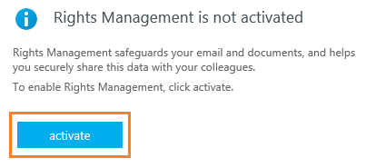

# Passo 1: ativar o serviço Rights Management
 
>*Aplica-se a: Azure Information Protection*

> [!NOTE]
>Se sabe que o serviço Azure Rights Management para o seu inquilino já está ativado, avance diretamente para o [passo seguinte](infoprotect-tutorial-step2.md). 
>
>Se não tem a certeza se este serviço está ativado, siga as instruções neste passo para o confirmar.

Quando o serviço Azure Rights Management for ativado, poderá proteger os e-mails e os documentos mais confidenciais da sua organização e controlar a forma como os documentos protegidos são utilizados quando os partilhar com outras pessoas. Existem diferentes métodos que pode utilizar para ativar este serviço, que incluem utilizar o Windows PowerShell e os portais de administração.

Para este tutorial, iremos avançar diretamente para a página de ativação no portal de administração para administradores do Office 365. No entanto, se preferir navegar para esta página a partir do seu portal de administração do Office 365, em vez de ir diretamente para a página, veja as instruções completas em [Ativar o Azure Rights Management](../deploy-use/activate-service.md). Além disso, utilize estas instruções completas se tiver acesso ao portal do Azure, mas não ao portal de administração do Office 365.

## Para ativar o serviço Rights Management

1. Abra uma nova janela do browser e aceda diretamente à [página de ativação do Rights Management](https://account.activedirectory.windowsazure.com/RmsOnline/Manage.aspx) para administradores do Office 365.
    
    Se lhe for pedido para iniciar sessão, utilize uma conta que seja um administrador global do Office 365.

2. Na página **rights management**, clique em **ativar**. Se este botão apresentar a opção **desativar**, significa que o serviço já está ativado e que pode avançar diretamente para o [passo seguinte](infoprotect-tutorial-step2.md). 

    

3. Quando lhe for perguntado **Pretende ativar o Rights Management?**, clique em **ativar** para confirmar.

    Já deverá estar visível **O Rights Management encontra-se ativado** e a opção para desativar (poderá ter de atualizar manualmente a página)

    Neste momento, não clique em **funcionalidades avançadas**. Isto leva-o para o portal clássico do Azure onde poderá configurar modelos personalizados, que não são necessários para este tutorial. Em vez disso, pode fechar esta página.

É tudo o que precisa de fazer neste primeiro passo para concluir este tutorial. Para uma implementação de produção, provavelmente, será útil configurar modelos personalizados como suplemento ou em vez de modelos predefinidos do Azure Rights Management. No entanto, os modelos personalizados não são necessários para este tutorial, pelo que pode ir para o passo 2.

|Se pretender mais informações|Informações adicionais|
|--------------------------------|--------------------------|
|Como ativar o Azure Rights Management|[Ativar o Azure Rights Management](../deploy-use/activate-service.md)|
|Acerca dos modelos predefinidos e de como criar modelos novos e personalizados|[Configurar modelos personalizados para o serviço Azure Rights Management](../deploy-use/configure-custom-templates.md)|

>[!div class="step-by-step"]
[&#171; Introdução](infoprotect-quick-start-tutorial.md)
[Passo 2 &#187;](infoprotect-tutorial-step2.md)

[!INCLUDE[Commenting house rules](../includes/houserules.md)]
