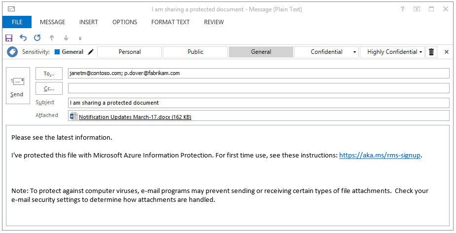

# Passo 5: ver a partilha de ficheiros protegidos em ação e controlar o seu documento 

>*Aplica-se a: Azure Information Protection*

Para este passo final do tutorial, localize um documento do Word ou folha de cálculo do Excel que já tenha criado e que irá enviar a um parceiro ou colega. Para este tutorial, é irrelevante o texto que de facto contém, mas é aconselhável que tenha algum texto para que possa mais facilmente confirmar que o destinatário autorizado o conseguiu ler.

Em seguida, está pronto para partilhar de forma segura este documento por e-mail. 

## Para partilhar de forma segura o seu documento por e-mail

1. No Explorador de Ficheiros, clique com o botão direito do rato no documento e selecione **Classificar e proteger**. É aberta a caixa de diálogo **Classificar e proteger – Azure Information Protection**:

    

2. Selecione **Proteger com permissões personalizadas** para apresentar opções adicionais.

3. Para **Selecionar permissões**, mantenha a predefinição **Visualizador – Ver Apenas**.

    Com esta definição, os nossos destinatários poderão visualizar o documento, mas não o poderão editar nem imprimir.

4. Em **Selecionar utilizadores**, escreva um ou mais endereços de e-mail empresariais, como faria ao enviar um documento a alguém com quem a sua organização trabalha. Certifique-se de que especifica um endereço de e-mail empresarial, tal como **janetm@contoso.com** ou **p.dover@fabrikam.com**, porque atualmente o Azure Information Protection não suporta endereços de e-mail pessoais. 

    Em alternativa, clique no livro de endereços para selecionar o endereço de e-mail de um colega:

      
    
    Após especificar os endereços, copie-os para a área de transferência porque serão utilizados num passo posterior.

5. Clique em **Aplicar** e aguarde pela mensagem **Trabalho concluído** para ver os resultados. Em seguida, clique em **Fechar**.

4. De volta ao Explorador de Ficheiros, clique com o botão direito do rato no ficheiro novamente e, desta vez, selecione **Enviar para** > **Destinatário de correio**. Esta ação anexa o documento a uma mensagem de e-mail com algum texto predefinido que iremos alterar.

5. Antes de alterarmos o texto predefinido, cole os endereços de e-mail que especificou anteriormente na caixa **Para**. 

6. Opcionalmente, escreva um assunto à sua escolha na caixa **Assunto** como, por exemplo: **Estou a partilhar um documento protegido**. 

7. Modifique a descrição da mensagem predefinida para que seja adequada aos seus destinatários. Contudo, adicione o seguinte texto:

    **Protegi este ficheiro com o Microsoft Azure Information Protection. Para a primeira utilização, veja estas instruções: https://aka.ms/rms-signup.** 

    

    Clique em **Enviar**.

Agora que enviou o documento protegido, pode pedir aos destinatários para o abrirem assim que o receberem. 

## Pedir aos destinatários para abrir o documento enviado por e-mail

Os destinatários podem utilizar vários dispositivos para ler o documento protegido que enviou como anexo de e-mail. Os dispositivos incluem iPads, iPhones, tablets e telemóveis Android, computadores Mac, bem como computadores Windows.

Peça-lhes para lerem a mensagem de e-mail que enviou. Partindo do princípio que esta é a primeira vez que receberam anexos protegidos pelo Rights Management, peça-lhes para clicarem na ligação de instruções. Em seguida, verão a página de **Boas-vindas** do Microsoft Azure Information Protection, que solicita a introdução do respetivo endereço de e-mail de trabalho.

Ao clicar em **Inscrever-se**, o Azure Information Protection verifica se a organização tem uma subscrição que inclui o serviço de proteção de dados do Azure Rights Management. Caso contrário, pode candidatar-se a uma conta gratuita.

### Instruções para o destinatário: para ver o anexo do documento protegido

1. Num PC ou dispositivo móvel que tenha o Office instalado, abra o anexo para ler o documento.  

2.  Se lhe for pedido o nome de utilizador e a palavra-passe, introduza o nome de utilizador no mesmo formato que o endereço de e-mail que foi utilizado para lhe enviar a mensagem de e-mail e o anexo. Por exemplo, **janetm@contoso.com** ou **p.dover@fabrikam.com**. Para a palavra-passe, escreva a que especificou quando se inscreveu no RMS para indivíduos. Em alternativa, se a sua organização tiver um serviço na cloud como o Office 365 ou utilizar o Azure, introduza a palavra-passe profissional habitual.

3. Leia os conteúdos do documento quando este for aberto. Uma vez que é só de leitura, não é possível alterar os conteúdos.

Como passo opcional, o destinatário pode reencaminhar o e-mail para outras pessoas que não tenha especificado no e-mail original. Estas pessoas não poderão abrir o anexo. Quando lhes for solicitado o respetivo nome de utilizador, o acesso ao documento será negado.

Agora que o destinatário abriu o anexo e, opcionalmente, o reencaminhou para outra pessoa, está pronto para monitorizar o seu documento.

## Para controlar o documento protegido

1.  Abra o documento que protegeu e partilhou. A faixa de informações confirma as definições de proteção personalizada que especificou:

    

2.  No separador **Base**, clique em **Proteger** > **Controlar e Revogar**:

    

    Isto leva-o para o site de controlo de documentos.

2.  Se vir a página **Proteção e partilha à sua medida**, clique em **Iniciar sessão** e indique novamente o nome de utilizador e a palavra-passe.

3.  Na página **Documentos partilhados**, irá ver o nome do documento que partilhou. Neste momento, é o único ficheiro apresentado, mas à medida que partilhar mais documentos protegidos, a lista aumenta.

    Nesta página, verá quando partilhou o documento (quando enviou a mensagem de e-mail com o anexo protegido), a data da última atividade e o nome do destinatário a quem enviou a mensagem de e-mail. Clique no nome do documento para obter mais detalhes.

4.  Na nova página, que tem o nome do ficheiro em que clicou, poderá ver detalhes do resumo apenas desse documento, bem como uma lista de outras opções que estão disponíveis para o documento (**Lista**, **Linha Cronológica**, **Mapa**, **Definições**).

    Clique em cada opção para explorar formas diferentes de controlar o documento protegido. Em alternativa, ainda na página **Resumo**, clique em **Abrir no Excel** para exportar as informações para uma folha de cálculo ou clique em **Revogar acesso** para deixar de partilhar o documento.

Pode voltar a este site para controlar mais atividades do documento protegido ou revogar o acesso, se necessário. Pode, inclusive, aceder ao site a partir do dispositivo móvel ou tablet, utilizando um browser com esta ligação: [controlo de documentos](http://go.microsoft.com/fwlink/?LinkId=529562)

|Se pretender mais informações|Informações adicionais|
|--------------------------------|--------------------------|
|Instruções completas para proteger os ficheiros que, em seguida, pode partilhar em segurança|[Classificar e proteger um ficheiro ou e-mail](../rms-client/client-classify-protect.md)|
|Acerca da conta gratuita para outros utilizadores se inscreverem|[RMS para utilizadores individuais e Azure Rights Management](../understand-explore/rms-for-individuals.md)|
|Acerca da utilização do site de controlo de documentos|[Controlar e revogar os documentos](../rms-client/client-track-revoke.md)

## Passos Seguintes

Agora que viu a política predefinida do Azure Information Protection, como personalizá-la e como funciona a etiquetagem para um documento do Word, experimente algumas das outras definições e saiba como funcionam nas outras aplicações do Office que suportam o Azure Information Protection: Excel, PowerPoint, Outlook. Se estas aplicações tiverem sido abertas quando instalou o cliente do Azure Information Protection, feche-as e volte a abri-las antes de tentar utilizá-las com o Azure Information Protection.

Experimente partilhar mais documentos e controlar a forma como estão a ser utilizados, e confirme como funciona a revogação de documentos.

Poderá ser-lhe útil ler algumas das [perguntas mais frequentes](faqs.md) do Azure Information Protection e explorar alguns dos outros artigos da documentação. No entanto, se estiver pronto para iniciar a implementação do Azure Information Protection para a sua organização, o passo seguinte deverá ser o [plano de implementação do Azure Information Protection](../plan-design/deployment-roadmap.md). 

[!INCLUDE[Commenting house rules](../includes/houserules.md)]