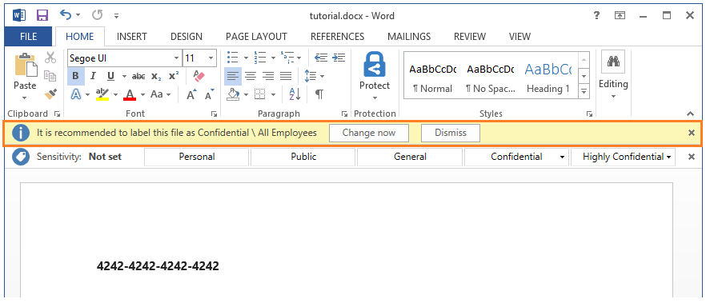

# Tutorial: Editar a política do Azure Information Protection e criar uma nova etiqueta

>*Aplica-se a: [Azure Information Protection](https://azure.microsoft.com/pricing/details/information-protection)*

Neste tutorial, ficará a saber como:
> [!div class="checklist"]
> * Configurar definições de política
> * Criar uma nova etiqueta 
> * Configurar a etiqueta para marcas visuais, recomendado classificação e proteção
> * Veja as suas definições e etiquetas em ação

Como resultado nesta configuração, os utilizadores veem uma etiqueta predefinida aplicada quando criam um novo documento ou e-mail. No entanto, é-lhes pedido para aplicar a nova etiqueta quando as informações de cartão de crédito são detectadas. Quando a nova etiqueta é aplicada, o conteúdo é reclassified e protegido, com um rodapé correspondente e o limite de tamanho. 

Pode concluir este tutorial em cerca de 15 minutos.

## Pré-requisitos 

Para concluir este tutorial, precisa de:

1. Uma subscrição que inclui o Azure Information Protection plano 2.
    
    Se não tiver uma subscrição que inclui o Azure Information Protection plano 2, pode criar uma [gratuita](https://portal.office.com/Signup/Signup.aspx?OfferId=87dd2714-d452-48a0-a809-d2f58c4f68b7) de conta para a sua organização.

2. Adicionei o painel do Azure Information Protection para o portal do Azure e confirmar que o serviço de proteção está ativado.

    Se precisar de ajuda com estas ações, consulte o artigo [início rápido: Adicionar o Azure Information Protection para o portal do Azure e ver a política](quickstart-viewpolicy.md)

3. O cliente do Azure Information Protection está instalado no seu computador. 
    
    Para instalar o cliente, vá para o [Centro de transferências da Microsoft](https://www.microsoft.com/en-us/download/details.aspx?id=53018) e transfira **AzInfoProtection.exe** da página do Azure Information Protection.

4. Um computador com Windows (no mínimo do Windows 7 com Service Pack 1), e neste computador, tem sessão iniciada para aplicações do Office de uma das seguintes categorias:
    
    - Versão mínima da aplicações do Office 1805, crie 9330.2078 do Office 365 empresas ou do Microsoft 365 empresas quando for atribuída uma licença do Azure Rights Management (também conhecido como Azure Information Protection para o Office 365).
    
    - Office 365 ProPlus.
    
    - Office Professional Plus 2019.
    
    - Office Professional Plus 2016.
    
    - Office Professional Plus 2013 com Service Pack 1.
    
    - Office Professional Plus 2010 com Service Pack 2.

Para obter uma lista completa de pré-requisitos para utilizar o Azure Information Protection, consulte [requisitos do Azure Information Protection](requirements.md).

Vamos começar.

## Editar a política do Azure Information Protection

Utilizar o portal do Azure, vamos alterar primeiro algumas definições de política e, em seguida, criar uma nova etiqueta.

### Editar as definições de política

1. Abra uma nova janela do browser e inicie sessão para o [portal do Azure](https://portal.azure.com) como um administrador global. Em seguida, navegue até **do Azure Information Protection**. 
    
    Por exemplo, no hub menu, clique em **todos os serviços** e comece a escrever **informações** na caixa Filtro. Selecione **Azure Information Protection**.
    
    Se não for o administrador global, utilize a seguinte hiperligação para funções de alternativas: [O início de sessão no portal do Azure](configure-policy.md#signing-in-to-the-azure-portal)

2. Selecione **classificações** > **políticas** > **Global** para abrir o **política: Global** painel. 

3. Localizar as definições de política depois das etiquetas, no **configurar definições para apresentar e aplicar-se sobre os usuários finais do Information Protection** secção. 
    
    Tome nota da forma como as definições estão atualmente configuradas. Especificamente, as definições **selecione a etiqueta predefinida** e **os utilizadores têm de fornecer justificação para definir uma etiqueta de classificação inferior, remover uma etiqueta ou remover a proteção**. Por exemplo:
    
    
    
    Vamos utilizar estas definições de política mais tarde no tutorial quando irá vê-los em ação.

4. Para **selecione a etiqueta predefinida**, selecione **geral**. 

    Se não tiver esta etiqueta porque tem uma versão mais antiga da política, selecione **Interno** como etiqueta equivalente.

5. Para **os utilizadores têm de fornecer justificação para definir uma etiqueta de classificação inferior, remover uma etiqueta ou remover a proteção**, defina esta opção como **no** se ainda não estiver.

6. Além disso, certifique-se de que **apresentar a barra de Information Protection nas aplicações do Office** está definida como **no**.

7. Selecione **salvar** nisso **política: Global** painel e se lhe for pedido para confirmar a ação, selecione **OK**. Feche este painel.

### Criar uma nova etiqueta para proteção, marcadores visuais e uma condição para pedidos de classificação

Vamos agora criar uma nova subetiqueta para **confidencial**.

1. Do **classificações** > **etiquetas** opção de menu: Com o botão direito a **confidencial** Etiquetar e selecione **adicionar uma etiqueta secundária**.
    
    Se não tiver uma etiqueta denominada **confidencial**, pode selecionar outra etiqueta ou pode criar uma nova etiqueta em vez disso e ainda, siga o tutorial com pequenas diferenças.

2. Sobre o **subetiqueta** painel, especifique o nome de etiqueta do **Finanças** e adicione a seguinte descrição: **Dados confidenciais que contém informações financeiras, que é restritas aos funcionários**.
    
    Este texto descreve como a etiqueta selecionada se destina a ser utilizado e é visível para os utilizadores como uma descrição para os ajudar a decidir qual a etiqueta a selecionar.

3. Para **definir permissões para documentos e e-mails que contenham esta etiqueta**, selecione **proteger**, que abre automaticamente o **proteção** painel selecionando o **Protection** opção para si:
    
     
    
4. Sobre o **proteção** painel, certifique-se de que **Azure (chave da cloud)** está selecionada. Esta opção utiliza o serviço Azure Rights Management para proteger documentos e e-mails. Também certificar-se de que o **definir permissões** opção está selecionada. Em seguida, selecione **adicionar permissões**.

5. Sobre o **adicionar permissões** painel, selecione **Add \<nome da organização >-todos os membros**. Por exemplo, se o nome da sua organização for VanArsdel Ltd, verá a seguinte opção para selecionar:
    
     
    
    Esta opção seleciona automaticamente todos os utilizadores na sua organização que pode ser concedida permissões. No entanto, pode ver as outras opções que pudesse e procurar grupos ou utilizadores do seu inquilino. Ou, quando seleciona a **introduza os detalhes** opção, pode especificar endereços de e-mail individuais ou até todos os utilizadores de outra organização.

6. Para obter as permissões, selecione **revisor** entre as opções predefinidas. Verá como esse nível de permissão concede automaticamente algumas permissões listados, mas não todas as permissões:
    
    
    
    Pode selecionar níveis de permissão diferentes ou especificar direitos de utilização individuais utilizando o **personalizado** opção. Mas este tutorial, mantenha a **revisor** opção. Pode experimentar com permissões diferentes, mais tarde e ler como restringir o que os utilizadores especificados podem fazer com o documento protegido ou o e-mail.

7. Clique em **OK** fechar isto **adicionar permissões** painel e veja como o **proteção** painel é atualizado para refletir a configuração. Por exemplo:
    
     
    
    Se selecionou **adicionar permissões**, esta ação abre o **adicionar permissões** painel novamente, para que pode adicionar mais utilizadores e conceder-lhes permissões diferentes. Por exemplo, apenas modo de exibição de conceder acesso a um grupo específico. Mas para este tutorial, vamos manter com um conjunto de permissões para todos os utilizadores.

8. Reveja e mantenha as predefinições para a expiração de conteúdo e acesso offline e, em seguida, clique em **OK** para guardar e fechar isso **proteção** painel.

8. Novamente o **subetiqueta** painel, localize a **definir marcas visuais** secção:
    
    Para o **documentos com esta etiqueta têm um rodapé** definir, clique em **no**e, em seguida, para o **texto** , escreva **classificado como confidencial** . 
    
    Para a definição **Documentos com esta etiqueta têm uma marca d'água**, clique em **Ativado** e, na caixa **Texto**, escreva o nome da organização. Por exemplo, **VanArsdel, Lda.** 
    
    Embora possa alterar a aparência para este marcadores visuais, vamos deixar estas definições nas predefinições por agora.
    
9. Localize a secção **Configurar condições para aplicar esta etiqueta automaticamente**:
    
    Clique em **adicionar uma nova condição** e, em seguida, no **condição** painel, selecione o seguinte:
    
    a. **Escolha o tipo de condição**: Mantenha a predefinição **tipos de informações**.
    
    b. Para **escolha um setor**: Mantenha a predefinição **todos os**.
    
    c. Na **seleciona os tipos de informações** caixa de pesquisa: Tipo **número de cartão de crédito**. Em seguida, resultados da pesquisa, selecione **número de cartão de crédito**.
    
    d. **Número mínimo de ocorrências**: Mantenha a predefinição **1**.
    
    e. **Contagem de ocorrências com apenas valores exclusivos**: Mantenha a predefinição **desativar**.
    
    
    
    Clique em **salvar** para voltar para o **subetiqueta** painel.

10. Sobre o **subetiqueta** painel, verá que **número de cartão de crédito** é apresentado como o **nome da condição**, com **1**  **OCORRÊNCIAS**:
    
    

11. Para **selecione a forma como esta etiqueta é aplicada**: Mantenha a predefinição **recomendado**e não altere a sugestão de política predefinida. 

12. Na **adicionar notas para utilização do administrador** , escreva **apenas para teste fins**.

13. Clique em **salvar** nisso **subetiqueta** painel. Se lhe for pedido para confirmar, clique em **OK**. A nova etiqueta é criada e guardada, mas ainda não foram adicionada a uma política.

14. Do **classificações** > **políticas** opção de menu: Selecione **Global** novamente e, em seguida, selecione a **etiquetas de adicionar ou remover** ligação depois das etiquetas.

15. Do **política: Adicionar ou remover as etiquetas** painel, selecione a etiqueta que acabou de criar, subetiqueta com o nome **Finance**e clique em **OK**.

16. Sobre o **política: Global** painel, verá agora sua nova subetiqueta na sua política global, que está configurada para marcas visuais e proteção. Por exemplo:

    
    
    Também pode ver que as definições são configuradas para a etiqueta predefinida e a justificação:
    
    
    

17. Clique em **salvar** nisso **política: Global** painel. Se lhe for pedido para confirmar esta ação, clique em **OK**.

Pode fechar o portal do Azure ou deixá-lo aberto para experimentar opções de configuração adicionais depois de concluir este tutorial.

Está pronto para experimentar os resultados das suas alterações.

## Ver classificação, etiquetagem e proteção em ação 

As alterações de política que fez e a nova etiqueta que criou aplica-se ao Word, Excel, PowerPoint e Outlook. Mas para este tutorial, vamos utilizar o Word vê-los em ação. 

Abra um novo documento do Word. Uma vez que o cliente do Azure Information Protection está instalado, verá o seguinte:

- Sobre o **home page** separador, uma **proteção** grupo, com um botão chamado **proteger**.
    
    Clique em **Proteger** > **Ajuda e Feedback** e, na caixa de diálogo **Microsoft Azure Information Protection**, confirme o estado do cliente. Deverá apresentar **Ligado como** e o seu nome de utilizador. Além disso, também deverá ver uma hora e data recentes para a última ligação e quando a política de Information Protection foi transferida. Verifique se o seu nome de utilizador apresentado está correto para o seu inquilino.

- Uma nova barra abaixo do friso; a barra do Information Protection. Apresenta o título de **sensibilidade**e as etiquetas que vimos no portal do Azure.

### Para alterar manualmente a nossa etiqueta predefinida

1. Na barra do Information Protection, selecione a última etiqueta e verá a forma como as subetiquetas são apresentadas:
    
    

2. Selecione uma destas subetiquetas e verá que as outras etiquetas já não apresentadas na barra de ter selecionado uma etiqueta para este documento. O **sensibilidade** nome muda de valor para mostrar a etiqueta e subetiqueta, com uma alteração correspondente da cor da etiqueta. Por exemplo:
    
    

3. Na barra do Information Protection, clique no ícone **Editar Etiqueta** junto ao valor da etiqueta selecionada:
    
    
    
    Esta ação apresenta as etiquetas disponíveis novamente.

4. Selecione a primeira etiqueta, **Pessoal**. Uma vez que selecionar uma etiqueta com uma classificação de nível inferior da etiqueta anteriormente selecionada para este documento, lhe for pedido para indicar a razão pela qual está a reduzir o nível de classificação:
    
    
    
    Selecione **A etiqueta anterior já não se aplica** e clique em **Confirmar**. O valor **Sensibilidade** é alterado para **Pessoal** e as outras etiquetas voltam a ficar ocultas.

### Para remover a classificação por completo

1. Na barra Information Protection, clique novamente no ícone **Editar Etiqueta**. Em vez de selecionar uma das etiquetas, clique no ícone **Eliminar Etiqueta**:
    
    
    
2. Desta vez, quando lhe for pedido, escreva "este documento não precisa classificar" e clique em **confirmar**.  
    
    Verá o **sensibilidade** valor a apresentar **nenastaveno**, que é que os utilizadores veem inicialmente para os novos documentos se não definir uma etiqueta predefinida como uma definição de política.

### Para ver um pedido de recomendação para etiquetagem e proteção automática

1. No documento do Word, escreva um número de cartão de crédito válido, por exemplo: **4242-4242-4242-4242**. 

2. Guarde localmente, o documento com um nome de ficheiro. 

3. Verá um pedido para aplicar a etiqueta que configurou para proteção quando forem detetados números de cartão de crédito. Se não concordar com a recomendação, a definição da política permite rejeitá-la ao selecionar **Dispensar**. Fornecer uma recomendação mas deixar que o utilizador a ignore ajuda a reduzir os falsos positivos quando utiliza a classificação automática. Para este tutorial, clique em **Alterar agora**.

    

    Para além do documento a mostrar que a etiqueta configurada foi aplicada (por exemplo, **confidencial \ Finanças**), verá imediatamente a marca d'água do nome da organização em toda a página e rodapé de  **Classificado como confidencial** também é aplicado. 

    O documento é também protegido com as permissões que especificou para esta etiqueta. Pode confirmar que o documento é protegido ao clicar o **arquivo** separador e ver as informações de **Proteger documento**. Verá que o documento é protegido pelo **confidencial \ Finanças** e a descrição da etiqueta. 
    
    Devido a configuração da proteção da etiqueta, apenas os funcionários podem abrir o documento e algumas ações são restritas para eles. Por exemplo, uma vez que não têm a impressão e a cópia e extrair conteúdas permissões, eles não é possível imprimir o documento ou a cópia do mesmo. Essas restrições quanto ajuda a evitar a perda de dados. Como o proprietário do documento, pode imprimi-lo e copiá-los. No entanto, se enviar por e-mail o documento para outro utilizador na sua organização, eles não podem fazer com que estas ações.

4. Agora, pode fechar este documento.

## Limpar recursos

Se não desejar manter as alterações efetuadas neste tutorial, faça o seguinte:

1. Selecione **classificações** > **políticas** > **Global** para abrir o **política: Global** painel.

2. Devolver as definições de política para os valores originais que apontou e, em seguida, selecione **guardar**. 

3. Partir do **classificações** > **etiqueta** opção de menu: Sobre o **do Azure Information Protection – a etiqueta** painel, selecione o menu de contexto (**...** ) para o **Finance** etiqueta que criou.

4. Selecione **eliminar esta etiqueta** e, se lhe for pedido para confirmar, selecione **OK**.

Reinicie o Word para transferir essas alterações.

## Passos Seguintes

Para obter mais informações sobre como editar a política do Azure Information Protection, consulte [política de configuração do Azure Information Protection](configure-policy.md).

Para obter mais informações sobre onde a atividade de etiquetagem está conectada, consulte [registo de utilização para o cliente do Azure Information Protection](./rms-client/client-admin-guide-files-and-logging.md#usage-logging-for-the-azure-information-protection-client).

