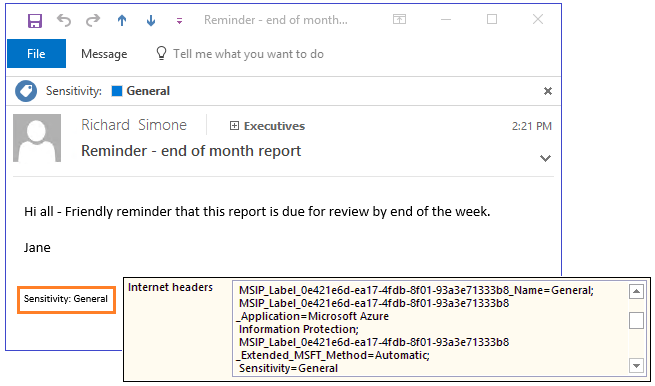

# O que é o Azure Information Protection?

>*Aplica-se a: [Azure Information Protection](https://azure.microsoft.com/pricing/details/information-protection)*

O Azure Information Protection (por vezes referido como AIP) é uma solução baseada na cloud que ajuda uma organização a classificar e proteger, opcionalmente, os respetivos documentos e e-mails através da aplicação de etiquetas. As etiquetas podem ser aplicadas automaticamente por administradores que definem regras e condições, manualmente pelos utilizadores ou uma combinação em que os utilizadores recebem recomendações. 

A imagem seguinte mostra um exemplo do Azure Information Protection em ação no computador de um utilizador. O administrador configurou uma etiqueta com regras que detetar dados confidenciais e no nosso exemplo, estas são informações de cartão de crédito. Quando um utilizador guarda um documento do Word que contém um número de cartão de crédito, vê uma descrição personalizada que recomenda a etiqueta que o administrador tenha configurado. Esta etiqueta classifica o documento e protege-la. 

Após os seus conteúdos serem classificados (e, opcionalmente, protegidos), pode acompanhar e controlar a forma como são utilizados. Pode analisar fluxos de dados para obter estatísticas sobre a sua empresa, detetar comportamentos de risco e tomar medidas corretivas, controlar o acesso a documentos, evitar a fuga ou utilização indevida de dados e assim sucessivamente.

## Como as etiquetas aplicam a classificação

Pode utilizar etiquetas do Azure Information Protection para aplicar a classificação a documentos e e-mails. Ao fazê-lo, a classificação será sempre identificável, independentemente de onde os dados são armazenados ou com quem são partilhados. As etiquetas podem incluem marcas visuais como um cabeçalho, rodapé ou marca d'água. Os metadados são adicionados aos ficheiros e cabeçalhos de e-mail em texto não encriptado. O texto não encriptado garante que outros serviços (tais como soluções de prevenção de perda de dados) conseguem identificar a classificação e tomar as medidas adequadas. 

Por exemplo, a seguinte mensagem de e-mail foi classificada como "Geral". A etiqueta tiver adicionado um rodapé de "Sensibilidade:"geral"à mensagem de e-mail. Este rodapé é um indicador visual para todos os destinatários a informar que o e-mail contém dados empresariais gerais que não deverão ser enviados para fora da organização. A etiqueta é incorporada nos cabeçalhos de e-mail para que os serviços de e-mail possam inspecionar este valor e poderia criar uma entrada de auditoria ou impedi-lo de que está a ser enviados fora da organização.

## Como os dados são protegidos

A tecnologia de proteção utiliza o *Azure Rights Management* (frequentemente abreviado para Azure RMS). Esta tecnologia está integrada com outros serviços e aplicações na cloud da Microsoft, como o Office 365 e o Azure Active Directory. Também pode ser utilizado com as suas próprias aplicações de linha de negócio e soluções de proteção de informações de fornecedores de software, sejam estas aplicações e soluções locais ou na cloud.

Esta tecnologia de proteção utiliza políticas de autorização, encriptação e identidade. De forma semelhante às etiquetas que são aplicadas, a proteção aplicada através do Rights Management mantém-se associada aos documentos e e-mails independentemente da sua localização, quer estejam dentro ou fora da sua organização, redes, servidores de ficheiros e aplicações. Esta solução de proteção de informações mantém o utilizador no controlo dos seus dados, mesmo quando são partilhados com outras pessoas.

Por exemplo, pode configurar um documento de relatório ou uma folha de cálculo de previsão de vendas para que só possa ser acedido por pessoas na sua organização e controlar se esse documento pode ser editado, restringi-lo para acesso só de leitura ou impedi-lo de ser impresso. Pode configurar os e-mails da mesma forma e, além disso, impedir que sejam encaminhados ou impedir a utilização da opção Responder a Todos. 

Estas definições de proteção podem ser parte da configuração de etiqueta, para que os utilizadores de classificar e protegerem documentos e e-mails simplesmente ao aplicar uma etiqueta. No entanto, as mesmas definições de proteção também podem ser utilizadas por aplicações e serviços que suportam a proteção, mas não etiquetagem. Para estas aplicações e serviços, as definições de proteção se tornar disponíveis como *modelos do Rights Management*.

### Modelos de gestão de direitos

Assim que o serviço Azure Rights Management está ativado, dois modelos predefinidos estão disponíveis para si que restringem o acesso a dados aos utilizadores na sua organização. Pode utilizar estes modelos para ajudar imediatamente a impedir a fuga de dados da sua organização. Também pode complementar estes modelos predefinidos ao configurar as suas próprias definições de proteção que apliquem controlos mais restritivos.

Quando cria uma etiqueta do Azure Information Protection, que inclui as definições de proteção, nos bastidores, esta ação cria um modelo de Rights Management correspondente. Além disso, em seguida, pode utilizar esse modelo com aplicações e serviços que suportam o Azure Rights Management.

Por exemplo, a partir do Centro de administração do Exchange, pode configurar regras de fluxo de correio Exchange Online para utilizar estes modelos:

Para obter mais informações sobre a proteção Azure Rights Management, consulte [o que é o Azure Rights Management?](what-is-azure-rms.md)

## Integração com fluxos de trabalho do utilizador final para documentos e e-mails

O Azure Information Protection integra-se com os fluxos de trabalho existentes de utilizadores finais quando o cliente do Azure Information Protection é instalado. Este cliente instala a barra do Information Protection em aplicações do Office, conforme vimos na primeira imagem que mostrava esta barra no Word. Esta barra do Information Protection é adicionada ao Excel, PowerPoint e Outlook. Por exemplo:

Esta barra do Information Protection torna mais fácil para os utilizadores finais selecionar etiquetas para a classificação correta. Se necessário, as etiquetas também podem ser aplicadas automaticamente de modo a reduzir o trabalho que os utilizadores teriam com essa tarefa ou para estarem em conformidade com as políticas da sua empresa.

Para classificar e proteger tipos de ficheiro adicionais e para suportar vários ficheiros ao mesmo tempo, os utilizadores podem clicar com o botão direito do rato nos ficheiros ou numa pasta do Explorador de Ficheiros do Windows:

Quando os utilizadores selecionam a opção de menu **Classificar e proteger** no Explorador de Ficheiros, podem selecionar uma etiqueta tal como quando utilizam a barra do Information Protection nas suas aplicações de ambiente de trabalho do Office. Também podem definir as suas próprias permissões personalizadas, se necessário.

Os utilizadores avançados (e os administradores) podem considerar a utilização dos comandos do PowerShell mais eficiente para gerir e definir a classificação e a proteção de vários ficheiros. Os comandos do PowerShell para realizar estas ações são incluídos automaticamente com o cliente, embora também possa instalar o módulo do PowerShell separadamente.

Depois de proteger um documento, os utilizadores e os administradores podem utilizar um site de controlo de documentos para saber quem acede aos documentos e quando. Se suspeitarem que há uma utilização indevida, podem também revogar o acesso aos documentos:

### Integração adicional de correio eletrónico

Quando utiliza o Azure Information Protection com o Exchange Online, recebe um benefício adicional: A capacidade de enviar e-mails protegidos para qualquer utilizador, com a garantia de que eles podem ser lidos em qualquer dispositivo.

Por exemplo, os utilizadores precisam enviar informações confidenciais para endereços de e-mail pessoais que utilizam um **Gmail**, **Hotmail**, ou uma **Microsoft** conta. Em alternativa, para os utilizadores que não têm uma conta no Office 365 ou Azure AD. Estes e-mails devem ser encriptados em descanso e em trânsito e ser lidos apenas pelos destinatários originais.

Este cenário requer os [novas capacidades de encriptação de mensagens do Office 365](https://techcommunity.microsoft.com/t5/Security-Privacy-and-Compliance/Email-Encryption-and-Rights-Protection/ba-p/110801). Se os destinatários não é possível abrir o e-mail protegido no cliente de e-mail nativo, podem utilizar um código de acesso único para ler as informações confidenciais num navegador.

Por exemplo, um utilizador de Gmail vê o seguinte numa mensagem de e-mail:

Para os utilizadores enviar o e-mail, seu fluxo de trabalho não é diferente de enviar um e-mail protegido para um utilizador na sua própria organização. Por exemplo, pode selecionar o **não reencaminhar** botão que o cliente do Azure Information Protection pode adicionar à faixa de opções do Outlook. Em alternativa, esta funcionalidade não reencaminhar pode ser integrada numa etiqueta que os utilizadores selecionarem, para que o e-mail é classificado como protegido:

Em alternativa, pode fornecer automaticamente a proteção para os utilizadores, ao utilizar as regras de fluxo de correio que se aplicam a proteção de direitos. 

Quando anexa documentos do Office para estes e-mails, esses documentos são automaticamente protegidos também.

## Classificar e proteger os documentos existentes

Idealmente, documentos e e-mails são rotuladas quando forem criados pela primeira vez. Mas, provavelmente tem muitos documentos existentes nos arquivos de dados e quer classificar e proteger esses documentos também. Esses arquivos de dados podem ser local ou na cloud.

Para os arquivos de dados no local, utilize o scanner do Azure Information Protection para detetar, classificar e proteger os documentos em pastas locais, compartilhamentos de rede e sites do SharePoint Server e bibliotecas. O scanner é executado como um serviço no Windows Server. Pode utilizar as mesmas regras na política para detetar informações confidenciais e aplique etiquetas de específicas aos documentos. Ou pode aplicar uma etiqueta predefinida para todos os documentos num repositório de dados sem inspecionar os conteúdos do ficheiro. Também pode utilizar o scanner em modo apenas de relatório para ajudar a detetar informações confidenciais que talvez não saiba que era necessário. 

Para obter mais informações sobre como implementar e utilizar a deteção de impressão, consulte [Implantando o scanner do Azure Information Protection para classificar e proteger ficheiros automaticamente](deploy-aip-scanner.md).

Para os arquivos de dados na cloud, utilize o Microsoft Cloud App Security para aplicar as etiquetas a documentos na caixa, SharePoint Online e OneDrive para empresas. Para obter mais informações, consulte [aplicar automaticamente etiquetas de classificação do Azure Information Protection](/cloud-app-security/use-case-information-protection) e [integração do Azure Information Protection](/cloud-app-security/azip-integration).

## Recursos para o Azure Information Protection

- Versão de avaliação gratuita: [Enterprise Mobility + Security E5](https://portal.office.com/Signup/Signup.aspx?OfferId=87dd2714-d452-48a0-a809-d2f58c4f68b7)

- As opções de assinatura e preços: [preços do Azure Information Protection](https://azure.microsoft.com/pricing/details/information-protection)

- Transferir o cliente: [cliente do Azure Information Protection](https://www.microsoft.com/en-us/download/details.aspx?id=53018)

- Baixe um guia do usuário personalizável: [o guia de adoção do Azure Information Protection utilizador final](https://download.microsoft.com/download/7/1/2/712A280C-1C66-4EF9-8DC3-88EE43BEA3D4/Azure_Information_Protection_End_User_Adoption_Guide_EN_US.pdf)

- FAQ: [Perguntas mais frequentes sobre o Azure Information Protection](faqs.md)

- Yammer: [Azure Information Protection](https://www.yammer.com/AskIPTeam)

Recursos adicionais: [informações e suporte do Azure Information Protection](information-support.md)

### O Microsoft Ignite

Microsoft Ignite 2018 em Orlando tinha muitas sessões que estejam identificadas [do Azure Information Protection](https://myignite.techcommunity.microsoft.com/sessions?q=Azure%2520Information%2520Protection). Todas as sessões foram registradas, para se não conseguiu participar nos lá, ainda pode ver as sessões posteriormente. Maiores cinco sessões que recomendamos que:

- [BRK2006 - utilização Microsoft Information Protection (MIP) para ajudar a proteger os seus dados confidenciais em qualquer lugar, em todo o ciclo](https://myignite.techcommunity.microsoft.com/sessions/64297) -veja o [vídeo do YouTube](https://youtu.be/gmHVF-1cLXA)
 
- [BRK3002 - Noções básicas sobre como capacidades do Microsoft Information Protection funcionam em conjunto para proteger informações confidenciais em dispositivos, aplicações e serviços](https://myignite.techcommunity.microsoft.com/sessions/64299) -veja o [vídeo do YouTube](https://youtu.be/kL9Y7NGTyQQ)

- [BRK3009 - acelerar a implementação e a adoção de soluções do Microsoft Information Protection](https://myignite.techcommunity.microsoft.com/sessions/64283) -veja o [vídeo do YouTube](https://www.youtube.com/watch?v=JsCyIVyQJmE)

- [BRK3397 - proteger e controlar suas mensagens de e-mail confidenciais com encriptação de mensagens do Office 365](https://myignite.techcommunity.microsoft.com/sessions/64327) -veja o [vídeo do YouTube](https://www.youtube.com/watch?v=Ld4b4pFua0g)

- [THR2003 - deteção de dados, relatórios de utilização e análise para todos os seus dados com o Microsoft Information Protection](https://myignite.techcommunity.microsoft.com/sessions/64301) -veja o [vídeo do YouTube](https://www.youtube.com/watch?v=nzDIXd0XaeA)

Para um rollup de anúncios que foram feitas neste Ignite, consulte a mensagem de blogue [anúncio da disponibilidade das funcionalidades de proteção de informações para ajudar a proteger os seus dados confidenciais](https://techcommunity.microsoft.com/t5/Enterprise-Mobility-Security/Announcing-availability-of-information-protection-capabilities/ba-p/261967).

## Passos Seguintes

Leia a publicação do blogue [Azure Information Protection: Ready, set, protect! (Azure Information Protection: deixar tudo a postos para proteger informações)](https://cloudblogs.microsoft.com/enterprisemobility/2017/02/21/azure-information-protection-ready-set-protect/)

Configure e veja mesmo, Azure Information Protection com o nosso 5-passo [tutorial de início rápido](infoprotect-quick-start-tutorial.md). Ou, se estiver pronto para implementar este serviço para a sua organização, consulte a [plano de implementação do Azure Information Protection](deployment-roadmap.md).

Será que conhece o Azure Information Protection por outro nome? Consulte nossos [lista de termos alternativos para o serviço](aka.md).

